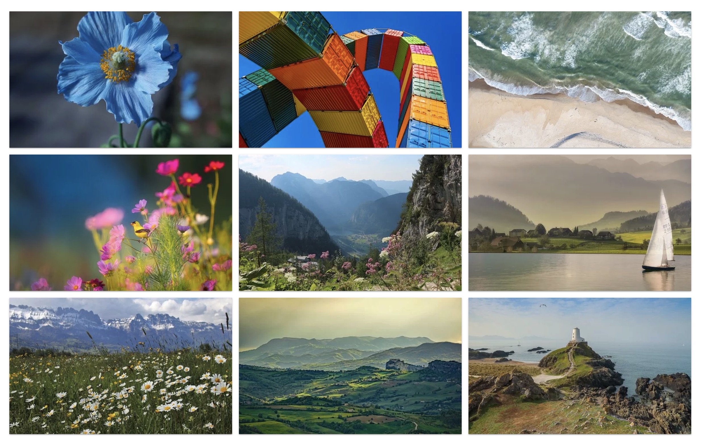

# goit-js-hw-08-gallery
goit-js-hw-08-gallery

**Читать на других языках: [Русский](README.md), [Українська](README.ua.md).**

# Критерии приема

- Создан репозиторий `goit-js-hw-08-gallery`.
- При сдаче домашней работы есть две ссылки: на исходные файлы и рабочую
  страницу на GitHub pages.
- При посещении рабочей страницы (GitHub pages) задания, в консоли нету ошибок и
  предупреждений.
- Имена переменных и функций понятные, описательные.
- Код отформатирован с помощью Prettier.

## Задание

Создай галерею с возможностью клика по ее элементам и просмотра полноразмерного
изображения в модальном окне. Превью результата посмотри
[по ссылке](https://take.ms/ZvBD0E).



Разбей задание на несколько подзадач:

- Создание и рендер разметки по массиву данных и предоставленному шаблону.
- Реализация делегирования на галерее `ul.js-gallery` и получение `url` большого
  изображения.
- Открытие модального окна по клику на элементе галереи.
- Подмена значения атрибута `src` элемента `img.lightbox__image`.
- Закрытие модального окна по клику на кнопку
  `button[data-action="close-lightbox"]`.
- Очистка значения атрибута `src` элемента `img.lightbox__image`. Это необходимо
  для того, чтобы при следующем открытии модального окна, пока грузится
  изображение, мы не видели предыдущее.

## Стартовые файлы

- В папке [src](./src) ты найдешь стартовые файлы проекта с базовой разметкой и
  готовыми стилями.
- В файле [gallery-items.js](./src/gallery-items.js) есть массив объектов
  содержащих информацию о изображениях: маленькое изображение, оригинальное и
  описание.

## Разметка элемента галереи

Ссылка на оригинальное изображение должна храниться в data-атрибуте `source` на
элементе `img`, и указываться в `href` ссылки (это необходимо для доступности).

```html
<li class="gallery__item">
  <a
    class="gallery__link"
    href="https://cdn.pixabay.com/photo/2010/12/13/10/13/tulips-2546_1280.jpg"
  >
    
  </a>
</li>
```

## Дополнительно

Следующий функционал не обязателен при сдаче задания, но будет хорошей практикой
по работе с событиями.

- Закрытие модального окна по клику на `div.lightbox__overlay`.
- Закрытие модального окна по нажатию клавиши `ESC`.
- Пролистывание изображений галереи в открытом модальном окне клавишами "влево"
  и "вправо".


            <!-- 1 Ссылка на оригинальное изображение должна храниться в data-атрибуте source на элементе img, и указываться в href ссылки (это необходимо для доступности). -->
      <li class="gallery__item">   
        <a
          class="gallery__link"
          href="https://cdn.pixabay.com/photo/2019/05/14/16/43/himilayan-blue-poppy-4202825_1280.jpg"
        >
          
        </a>
      </li>
            <!-- 2 -->
      <li class="gallery__item">   
        <a
          class="gallery__link"
          href="https://cdn.pixabay.com/photo/2019/05/14/22/05/container-4203677_1280.jpg"
        >
          
        </a>
      </li>
            <!-- 3 -->
      <li class="gallery__item">   
        <a
          class="gallery__link"
          href="https://cdn.pixabay.com/photo/2019/05/16/09/47/beach-4206785_1280.jpg"
        >
          
        </a>
      </li>
            <!-- 4 -->
      <li class="gallery__item">   
        <a
          class="gallery__link"
          href="https://cdn.pixabay.com/photo/2016/11/18/16/19/flowers-1835619_1280.jpg"
        >
          
        </a>
      </li>
            <!-- 5 -->
      <li class="gallery__item">   
        <a
          class="gallery__link"
          href="https://cdn.pixabay.com/photo/2018/09/13/10/36/mountains-3674334_1280.jpg"
        >
          
        </a>
      </li>
            <!-- 6 -->
      <li class="gallery__item">   
        <a
          class="gallery__link"
          href="https://cdn.pixabay.com/photo/2019/05/16/23/04/landscape-4208571_1280.jpg"
        >
          
        </a>
      </li>
            <!-- 7 -->
      <li class="gallery__item">   
        <a
          class="gallery__link"
          href="https://cdn.pixabay.com/photo/2019/05/17/09/27/the-alps-4209272_1280.jpg"
        >
          
        </a>
      </li>
            <!-- 8 -->
      <li class="gallery__item">   
        <a
          class="gallery__link"
          href="https://cdn.pixabay.com/photo/2019/05/16/21/10/landscape-4208255_1280.jpg"
        >
          
        </a>
      </li>
            <!-- 9 -->
      <li class="gallery__item">   
        <a
          class="gallery__link"
          href="https://cdn.pixabay.com/photo/2019/05/17/04/35/lighthouse-4208843_1280.jpg"
        >
          
        </a>
      </li>
            <!-- 10 -->
      <li class="gallery__item">   
        <a
          class="gallery__link"
          href="https://cdn.pixabay.com/photo/2010/12/13/10/13/tulips-2546_1280.jpg"
        >
          
        </a>
      </li>

